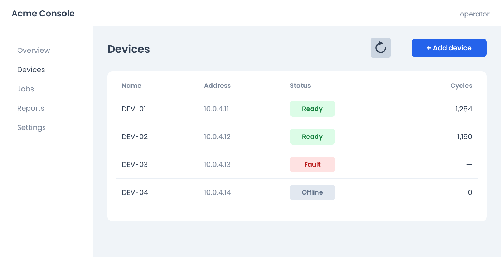

# screenshot-annotate

A Claude Code skill that draws callouts on screenshots for help documentation — numbered bubbles,
hand-drawn rings, sweeping arrows, labels, highlighter bands and gradient backdrops — and composites
them onto the **real capture**. It never redraws the UI.

Node + [sharp](https://sharp.pixelplumbing.com/) + [Rough.js](https://roughjs.com/) +
[resvg](https://github.com/yisibl/resvg-js). No browser, no cloud service, no design tool. Runs
offline once installed, in about a second per figure.



That is the *input*. One command and a short JSON spec later, `out/demo.png` is the same screenshot
with three controls ringed and labelled on a gradient — and the spec contains no pixel coordinates
anywhere, which is the part that matters. See [The demo](#the-demo) below.

---

## Why this exists rather than a design tool

**A documentation figure is the real capture with annotations on top. Never a regenerated
approximation.** A figure that is a lookalike of the product rather than the product is worse than no
figure, because the reader trusts it and it lies to them. Any tool that cannot ingest the actual PNG
is disqualified — a hosted service was tried first and could only ingest images from a public HTTPS
URL, so all it could produce was a fabricated login screen with arrows pointing at invented pixels.

The corollary, and the reason this is 180 KB of JavaScript rather than a wrapper around ImageMagick:
**specs describe targets, they never contain coordinates.** A spec says *"the second wide swatch
inside the white card"*. A pixel detector resolves that at render time. Retake the screenshot at a
different window size and the figure still points at the right control — where a hardcoded
coordinate would still render, still report success, and point at nothing.

---

## Install

**Requires Node 18.17+.** Developed and verified on Node 22.15 / npm 10.1, Windows 11 x64.

1. Drop the `screenshot-annotate` folder into your project's skills directory:

   ```
   <your-repo>/.claude/skills/screenshot-annotate/
   ```

   (Or `~/.claude/skills/screenshot-annotate/` to make it available in every project. Project-local
   is better here, because the figures and specs you make belong with the docs they illustrate.)

2. Install the dependencies:

   ```bash
   cd .claude/skills/screenshot-annotate
   npm install
   ```

3. Verify — three commands, in this order. Each one proves something different:

   ```bash
   node test/font-path.test.mjs                  # 1. the renderer can load the fonts
   node scripts/annotate.mjs example/demo.json   # 2. the whole pipeline runs
   node test/golden.test.mjs                     # 3. it produced the exact expected bytes
   ```

   Expected output:

   ```
   PASS  hand         Patrick Hand 400  ink=7569
   PASS  markerBold   Kalam 700  ink=12225
   PASS  marker       Kalam 400  ink=7553
   PASS  highlighter  Architects Daughter 400  ink=9761
   PASS  clean        Poppins 400  ink=9444
   PASS  cleanBold    Poppins 600  ink=14701
   All faces rasterised through explicit fontFiles.

   marker-rings on aubergine  crop 1400x720  margin 246/609/63/590
     ...\out\demo.png  2600x1029  319 KB

   PASS      demo  0 px differ
   1 figure(s) stable.
   ```

   Step 1 matters more than it looks: **a missing font renders as blank space rather than raising an
   error**, so "it didn't crash" proves nothing. That test counts rendered ink per face.

   Step 3 is a byte-for-byte comparison against a golden recorded on Windows x64. If you are on macOS
   or Linux and it reports a small number of differing pixels, that is a platform difference in the
   image encoder, not a broken install — look at `out/demo.png`, confirm it is right, and re-record
   with `node test/golden.test.mjs --update`.

### About the native dependencies

Two of the six dependencies are native: `sharp` (libvips image compositing) and `@resvg/resvg-js`
(Rust SVG rasteriser). **Neither compiles anything on install.** Both publish prebuilt N-API binaries
as platform-specific optional dependencies, and `package-lock.json` here lists all of them — win32
x64/ia32/arm64, darwin x64/arm64, linux x64/arm64/arm/s390x, musl variants. npm picks the one
matching your machine. No Python, no Visual Studio build tools, no `node-gyp`.

The install to expect on a Windows x64 machine is **23 packages in a couple of seconds**. If you see
npm trying to compile, something has gone wrong — most likely `npm install --no-optional`,
`--ignore-optional`, or an npm older than 9.6.5, all of which break optional-dependency resolution
for sharp. Use a plain `npm install`.

`npm audit` reports **one high-severity advisory** against `sharp@0.33.5`
([GHSA-f88m-g3jw-g9cj](https://github.com/advisories/GHSA-f88m-g3jw-g9cj), inherited libvips CVEs).
Do not blind-fix it: `npm audit fix --force` moves you to `sharp@0.35`, which is a major bump and will
change the rendered bytes, breaking every golden you have recorded. The advisory concerns decoding
untrusted images; this tool decodes screenshots you took yourself. Upgrade deliberately, on its own
commit, and re-record the goldens after looking at the diffs.

### Why `roughjs`, pinned at exactly 4.6.6

Rough.js is what makes the annotations look hand-drawn instead of like clip art, and it is pure
JavaScript with no native code or DOM requirement — the skill uses `rough.generator()`, which emits
SVG path data rather than drawing to a canvas.

It supplies every stroke in a figure: the rings around controls, the sweeping leader arrows and their
barbs, the numbered bubbles, and the wobbly edge on a `labelPlate`. The prototype hand-rolled all of
this — perpendicular noise on resampled paths, each stroke inked twice, tapered wobble at the ends —
and Rough.js does it natively via `roughness` and `bowing`, plus one thing the noise code never had: a
**seed**. Same seed in, same path data out, so the same spec renders byte-identical every time.

That is why the version is pinned exactly rather than caret-ranged. Rough.js makes no promise that a
given seed produces the same geometry across releases, so a minor bump could silently restyle every
figure in your manual. `@resvg/resvg-js` is pinned for the same reason. `test/golden.test.mjs` is
what catches it if either ever moves.

### About the fonts

`assets/fonts/` carries six TTFs (1.5 MB): Patrick Hand, Kalam Regular + Bold, Architects Daughter,
Poppins Regular + SemiBold.

**They are required at render time, not a convenience.** resvg is handed the files explicitly through
`font.fontFiles` with `loadSystemFonts: false`. That is deliberate: name-based lookup against
installed system fonts renders differently on every machine and falls back silently when a name
misses, producing a figure that looks fine locally and wrong in CI. Delete the TTFs and every figure
renders with no text at all.

They cannot be replaced with an npm package. `@fontsource/*` ships only `.woff` and `.woff2`, and
resvg's font database will not load woff2 — verified against `@fontsource/patrick-hand@5`, which
ships no TTF at all.

**Licensing is not a problem.** All six faces are SIL Open Font License 1.1, which explicitly permits
redistribution and commercial documentation use. The license text and per-family copyright notices
travel with them in [`assets/fonts/OFL.txt`](assets/fonts/OFL.txt), which the OFL requires you keep
alongside the fonts if you copy that directory anywhere. `assets/fonts/README.md` has the commands to
refetch them from `google/fonts` if you ever need to.

---

## The demo

One command, no screenshot of your own needed:

```bash
node scripts/annotate.mjs example/demo.json
```

It reads [`example/sample-app.png`](example/sample-app.png), resolves three targets by description,
and writes `out/demo.png` — a 2600×1029 figure on an aubergine backdrop, with two numbered callouts
and one unnumbered one in three different gutters.

The spec that produced it is [`example/demo.json`](example/demo.json), and it is commented throughout
in `_`-prefixed keys the tool ignores. **Read it before writing your own.** It explains every decision
in the figure, including the five callouts that were considered and cut — see
[What the demo is teaching](#what-the-demo-is-teaching) below.

The workflow it demonstrates is the whole skill in four steps:

```bash
# 1. Ask the detector what it can see. This is the vocabulary your spec gets to use.
node scripts/measure.mjs example/sample-app.png

#    example/sample-app.png  1400x720  background #FFFFFF (67%)
#    borders: 1 horizontal, 1 vertical
#    swatches: 15
#
#    largest swatches:
#      (300,267)-(1360,620)  1060x353  #FFFFFF  fill 0.918  edge 0.983   the table card
#      (261,73)-(1400,720)   1139x647  #F0F4F8  fill 0.375  edge 1       page ground
#      (0,73)-(260,720)      260x647   #FFFFFF  fill 0.982  edge 1       left nav
#      (0,0)-(1400,72)       1400x72   #FFFFFF  fill 0.977  edge 1       title bar
#      (300,200)-(1360,266)  1060x66   #FFFFFF  fill 0.97   edge 0.979   table header band
#      (1150,108)-(1360,160) 210x52    #2563EB  fill 0.898  edge 0.863   + Add device
#      (810,439)-(936,483)   126x44    #FEE2E2  fill 0.924  edge 0.835   the Fault chip
#      (810,283)-(936,327)   126x44    #DCFCE7  fill 0.896  edge 0.859   a Ready chip
#      (810,361)-(936,405)   126x44    #DCFCE7  fill 0.896  edge 0.859   a Ready chip
#      (810,517)-(936,561)   126x44    #E2E8F0  fill 0.894  edge 0.835   the Offline chip
#      (1036,106)-(1092,162) 56x56     #CBD5E1  fill 0.873  edge 0.821   the refresh button
#      ...
#
#    horizontal borders: 72
#    vertical borders:   260
#
#    Note the ORDER: largest first, not top to bottom. `order` on a selector changes it.

# 2. Write a spec that DESCRIBES those regions. Never "(810, 439)"; always
#    "the #FEE2E2 swatch inside the table card".

# 3. Render it.
node scripts/annotate.mjs example/demo.json

# 4. OPEN THE PNG AND LOOK AT IT. Not optional. A spec that resolves cleanly can still
#    ring the wrong control, and nothing in the console will say so.
```

Two flags worth knowing immediately:

```bash
node scripts/annotate.mjs example/demo.json --style plain-ink --out out/try.png
node scripts/annotate.mjs example/demo.json --contact-sheet --out out/sheet   # all nine styles
```

> **`example/sample-app.png` is a drawn mock. It is a TEST FIXTURE, not a licence.** It exists for
> exactly one reason: so the install can be proved end to end on a machine that has none of your
> screenshots on it. It is not a documentation figure, and **a real project must annotate real
> captures of the real product** — that is the one rule at the top of this file, and drawing a
> lookalike is the specific thing it forbids. Point every real spec's `source` at a genuine capture.
> (`example/make-sample.mjs` regenerates the fixture, so it is reproducible rather than a mystery
> binary, and its header says the same thing.)

### What the demo is teaching

The three callouts were not picked because they were easy to point at. Each one passes the single
test in [`DOCTRINE.md`](DOCTRINE.md) — **does the callout say something the picture doesn't?**

| | Target | Label | Why it earns its place |
|---|---|---|---|
| **1** | the wordless refresh button | *Re-polls every device; it does not restart them* | An unlabelled glyph — the clearest case there is — plus the **scope**, which is the half that matters |
| **2** | **+ Add device** | *Saves the address; the device is not contacted yet* | The caption already says "add". The **consequence** of adding is what the picture cannot show |
| — | the red **Fault** chip | *A faulted device keeps its slot and takes no work* | The chip already says Fault. What follows from it does not. **Unnumbered on purpose**: it explains a state, it is not a step, and inventing a "3" would put the figure out of step with the prose |

**Five more were considered and cut**, and the spec records all five in its `_rejected` key. That is
not paperwork — without it the next person re-proposes one and the argument gets had twice. Four were
cut for saying nothing (the device names, the green *Ready* chips, the `operator` identity, the
highlighted nav row). The fifth is the instructive one: *"a dash means never run, not zero"* is a
genuinely honest callout about the Cycles column, and it was dropped because **it cannot be targeted
without a coordinate** — that cell has no uniform fill and no rule bounding it. *Can I describe this
without a coordinate?* is part of choosing a callout, not a step that comes afterwards.

The first version of this fixture was a sign-in card, and it was thrown away for failing its own
test: a username field, a password field and a Continue button are all self-describing, so every
callout available just read the label back to the reader.

---

## What you'll need to change for your project

The good news first: **nothing under `scripts/` contains a path to any repository, machine or
application.** It was grepped for `docs/`, drive letters, home directories, Playwright binaries and
localhost URLs, and it is clean. Every module resolves paths relative to the spec file it was handed.
There is no configuration file to edit and no constant to find.

Everything repo-specific is in prose and in the specs you write. Here is all of it.

### 1. The two paths that actually matter — in every spec you write

These are the only configuration points in the whole tool:

| Spec key | What to set it to |
|---|---|
| `source` | Your raw capture, relative to the spec file. Convention: `figures/sources/<name>.png` |
| `output` | Where the finished figure lands, relative to the spec file. Typically your docs' image directory, e.g. `../../../docs/images/<section>/<name>.png` |

**`source` must never point at a published figure.** If it points at the same file as `output`, the
next render annotates its own output and you get rings drawn on top of rings, with the goldens
drifting every run. Keep raw captures in `figures/sources/` and treat published PNGs as read-only.

Create `figures/` yourself — it is not in the bundle, because it is your working set. `out/` is
scratch for experiments and is created on demand.

### 2. `--verify` will not work until you write your own fixture

`scripts/measure.mjs` ships two hand-measured fixtures named `app-shell` and `sign-in`
(around line 721). They are the pixel coordinates of controls in two PSV captures that are **not** in
this bundle, so `node scripts/measure.mjs <image> --verify app-shell` cannot pass for you.

This is a self-test for the *detector* — it proves the pixel-detection code still finds known
elements after you change it — not part of making a figure. Either ignore it, or replace the
`FIXTURES` object with coordinates measured from one of your own captures if you plan to modify
`measure.mjs`. Nothing else reads it.

### 3. Prose that names PSV screens

None of this affects rendering. It is flagged so you know what you are reading when you hit it:

| File | What's PSV-specific |
|---|---|
| `DOCTRINE.md` | Names figures (`unsaved-changes`, `sign-in`, `service-mode-banners`…) as worked examples. The rules and numbers are general; the screens are not. Preamble says so |
| `references/style-guide.md` | §3's colour tokens are Data I/O's brand palette — `#054BAA` is the only brand-verified value, and the amber/ink choices follow from it. §6 lists the eight backdrop gradients. §8 "Unresolved" is entirely PSV product questions and will mean nothing to you. Change §3 to your own palette; the rest transfers |
| `references/style-guide.md` §6 | Mentions a `pad-clip.mjs` step that composites 48 px of synthesized margin. That script is not in this bundle and is not needed — the passage is about *why stacking synthesized margin under a backdrop breaks the drop shadow*, which applies to any padding step you might write |
| `examples/` | Entirely PSV, on purpose, and labelled as such. Every figure page's header line is a `docs/help/images/...` path |
| `SKILL.md`, `example/demo.json` | Rewritten for this bundle. No repo paths remain |

### 4. Things you might expect to find and won't

- **No browser automation.** This skill annotates a PNG; it does not take one. How you capture is
  your problem — Playwright, the OS snipping tool, whatever. There is no `executablePath` to fix and
  no Chromium to install. (`DOCTRINE.md` has two capture lessons worth reading anyway: device scale
  factors, and a sharp `png({ effort })` gotcha that silently quantises to 256 colours.)
- **No site-specific layout assumptions in code.** The one place page layout enters is `fontScale`,
  and that is per-spec. `DOCTRINE.md` gives you the arithmetic
  (`capture-font-size × column-width ÷ clip-width`) — measure your own docs' content column once and
  the rest follows.
- **No CI configuration.** `npm test` is the golden suite and is safe to wire into a pipeline as-is.

---

## What to read, in order

1. **[`DOCTRINE.md`](DOCTRINE.md)** — the most valuable file here, and the one you cannot re-derive.
   When a callout earns its place; when a backdrop applies and what it costs; why a label that
   renders fine can still be illegible, with the contrast arithmetic that proves no colour will fix a
   mid-grey ground; how cropping changes a figure's size on the page. Twenty minutes.
2. **[`SKILL.md`](SKILL.md)** — the reference. Every spec key, all five selector kinds, the nine
   styles, the shipping checklist. This is also what Claude Code reads when the skill activates.
3. **[`example/demo.json`](example/demo.json)** — the annotated worked spec.
4. **[`references/style-guide.md`](references/style-guide.md)** — the rules the code implements and
   why, including several learned by getting them wrong first. Read before changing a constant.
5. **[`examples/`](examples/)** — twenty-nine real figures with their reasoning. Reference, not
   required reading. Start with [`examples/README.md`](examples/README.md).

## Layout

```
README.md          this file
SKILL.md           the skill definition — what Claude Code loads
DOCTRINE.md        how to decide what figure to make        <- read this
MANIFEST.md        what is in this bundle and what was left out
package.json       6 dependencies, 2 of them pinned exactly
scripts/           the tool. 10 modules + 9 style presets, no repo-specific paths
  measure.mjs        pixel detection: borders, swatches, ink clusters (CLI + library)
  select.mjs         resolve a spec's target descriptions to rectangles
  layout.mjs         sides, margins, crop, label placement, leader routing
  drawing.mjs        SVG emission; Rough.js strokes, masks, text
  geometry.mjs       rounded-rect outlines, arrowheads, route search
  text.mjs           real metrics from the TTFs via opentype.js
  render.mjs         resvg rasterisation + sharp compositing
  fonts.mjs          font registry and resvg's explicit fontFiles
  palette.mjs        colour tokens and backdrop gradients
  annotate.mjs       the CLI
  styles/            one module per preset, over four shared draw engines
assets/fonts/      six SIL OFL TTFs + the licence. Required at render time
references/        style-guide.md — the rules the code implements, and why
example/           sample-app.png + demo.json: a self-contained end-to-end demo
examples/          29 worked figure pages from the PSV manual. Reference
test/              font-path.test.mjs (install check), golden.test.mjs (determinism)
```

## Troubleshooting

| Symptom | Cause |
|---|---|
| Figure renders with no text at all | resvg could not load the TTFs. Run `node test/font-path.test.mjs` |
| `No swatch matched {...}` | Your selector describes something the detector cannot see. Run `node scripts/measure.mjs <image>` and use what it actually reports |
| Every ring is one control off | `within` **excludes** the container itself, so index 0 is the first thing *inside* it. A spec that indexes as if the container counted shifts everything by one |
| `warning: leader for "..." could not avoid every element` | The router could not find a clean path. Set `side` explicitly rather than ignoring it |
| Rings look furry rather than sketched | Something is passing raw sampled points to Rough.js instead of a three-node quadratic. See the note in `drawing.mjs:polyline` |
| npm tries to compile something | You used `--no-optional` / `--ignore-optional`, or npm < 9.6.5. Plain `npm install` |
| Golden fails on a fresh clone with a handful of pixels | Different platform than the golden was recorded on. Look at the output, then `--update` |
