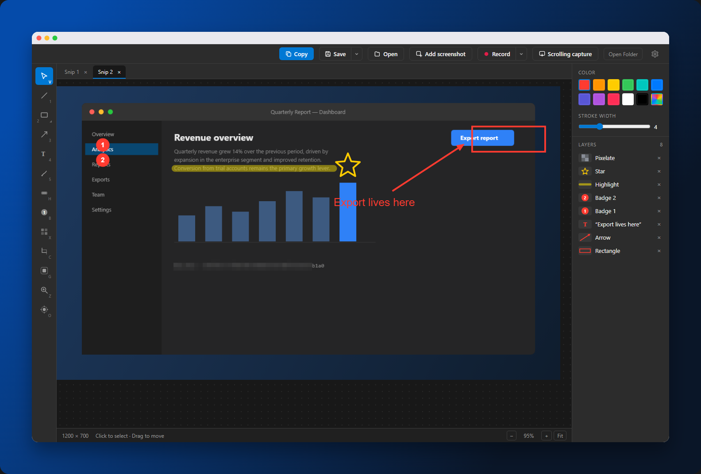
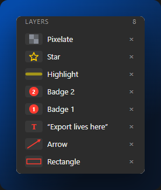
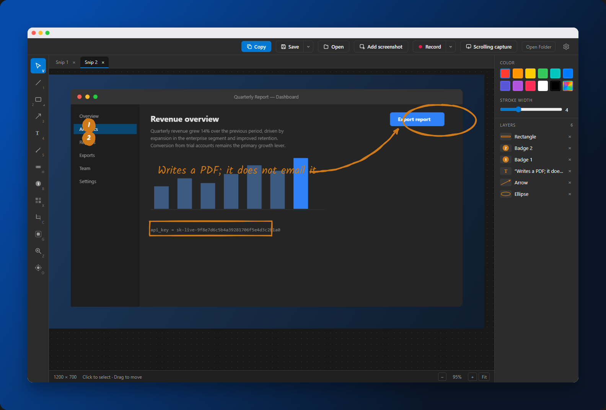
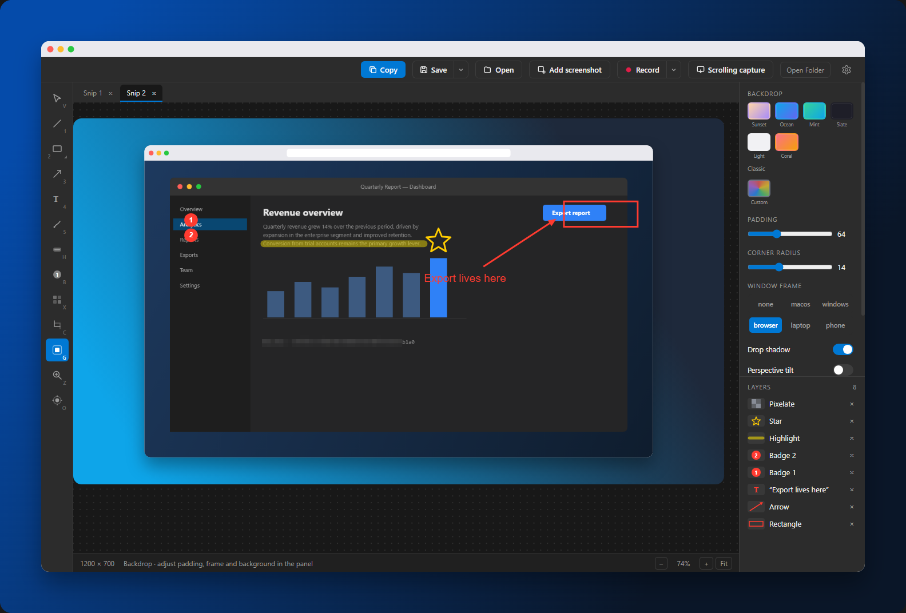
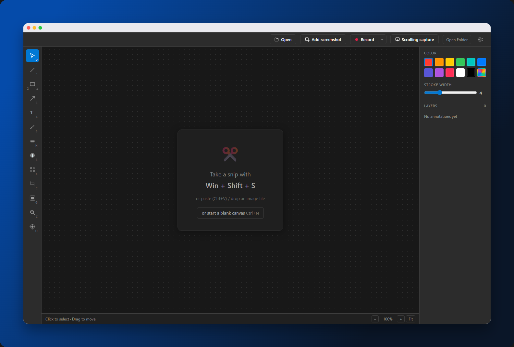

# snippr

**A companion to the Windows Snipping Tool — snip with `Win+Shift+S`, annotate instantly, copy or save.**

<br clear="left" />

snippr sits in your system tray and watches the clipboard. The moment the native Snipping Tool captures a screenshot, the snippr editor pops up with it loaded — draw arrows, boxes, text, badges, blur out secrets, then put the result back on the clipboard or save it as a PNG. No capture UI of its own, no replacing what Windows already does well.

Beyond annotating snips, it also does the captures Windows can't: **scrolling capture** for long pages, **screen recording** to MP4/GIF, and a **Beautify** backdrop for polished, shareable shots.



## How it works

1. **Snip** anything with `Win+Shift+S` (the normal Windows flow)
2. snippr detects the screenshot on the clipboard and opens the editor
3. **Annotate**, then **Copy** (`Ctrl+C`) or **Save** (`Ctrl+S`) — done

Ordinary copied images don't trigger the editor — snippr checks that the clipboard write came from the Snipping Tool (there's a setting to trigger on any image if you prefer).

## Features

- **Annotation tools** — line, rectangle, ellipse, triangle, diamond, star, arrow, freehand pen, highlighter, text, auto-numbered step badges (numbers editable in the properties panel)
- **Hand-drawn style** — render any outline shape as a loose, marker-style stroke instead of clean vector; curved arrow leaders, adjustable arrowhead size and hand-lettered label fonts (see below)
- **Photoshop-style tool flyout** — hold or right-click the shape button to pick its variants; the button remembers your last choice (the corner caret marks grouped tools)
- **Color presets** — the usual palette one click away; the last swatch unfolds the full picker with a hex input
- **Beautify backdrop** — wrap a screenshot in padding, a gradient/solid background, rounded corners, a drop shadow and a macOS/browser window frame; non-destructive, baked only on export (see below)
- **Screen recording** — record a region to **MP4** or **GIF** at 10/20/30 fps, with the cursor captured and a live outline around the recorded area (see below)
- **Scrolling capture** — grab an entire scrollable page as one tall image (see below)
- **Add screenshot** — grab any screen region and drop it straight into the current document (or a new tab if nothing's open)
- **Open existing images** — paste (`Ctrl+V`) or drag files in; with nothing open the image becomes the tab's background, with a document open it lands as a movable **image layer** on top
- **Pixelate** — drag a region to censor API keys, emails, faces
- **Crop** — non-destructive; adjust or remove it any time before export
- **Tabs** — every snip opens its own tab with independent annotations and undo history
- **Layers panel** — every annotation listed with a live geometry preview; click to select, double-click text to edit, `×` to delete
- **Full undo/redo**, drag/resize via selection handles, drag anywhere inside the selection box
- **Smart export bounds** — annotations placed outside the image grow the exported canvas instead of being clipped
- **Design-tool canvas** — dot-grid backdrop that pans and zooms with the view (never baked into exports)
- **Tray app** — starts with Windows (optional), single instance, close-to-tray

<table>
<tr>
<td width="60%" valign="top">

### Layers with live previews

Each row renders a miniature of the actual shape — its real geometry and color. Pen strokes are down-sampled, arrows keep their heads, text shows its content.

</td>
<td>



</td>
</tr>
</table>

## Hand-drawn annotations

Every outline shape — rectangle, ellipse, the polygon set, arrow, line and step badges — can be drawn as a loose marker stroke instead of clean vector. Flip **Hand-drawn** in the properties panel and the shape re-renders sketched; **Roughness** controls how loose, and **New wobble** rerolls the randomness when a particular squiggle bothers you.



Arrows gain two extras that matter for callouts: a **Curve**, so a leader sweeps to its target rather than poking at it, and a **Head Size** multiplier for when the arrowhead looks shy against a heavy stroke. Text can be set in one of three hand-lettered faces — Kalam, Patrick Hand, Architects Daughter — bundled with the app rather than fetched, so exports render identically offline.

The wobble is seeded per annotation and stored alongside it, so a shape looks the same every time the document is reopened and in the exported PNG. Toggling the style never changes a shape's color — it is a rendering switch only, so it is safe to flip on annotations you have already placed.

## Beautify

Turn a bare screenshot into something worth posting. The **Backdrop** tool (`G`, or the shield icon in the tool rail) wraps the image in a padded, colored background with rounded corners and a soft shadow — optionally inside a macOS or browser window frame.



Everything is driven from the **Backdrop** panel: a background preset grid (gradients or solids), padding and corner-radius sliders, the window frame (None / macOS / Browser), a drop-shadow toggle, and an aspect ratio (Auto / 1:1 / 16:9 / 4:3) that pads the short side to hit the target shape.

It's **non-destructive**, exactly like Crop — the backdrop lives in document state, survives undo/redo and tab switches, and is only baked into the pixels on **Copy** / **Save** (at native resolution, with your annotations on top). Annotations stay glued to the screenshot, not the backdrop. (Backdrop and Crop are mutually exclusive for now.)

## Screen recording

Record a slice of your screen to a video file — the capture Windows' tool doesn't do at all:

1. Pick a format from the **Record** dropdown (caret next to the button): **MP4** or **GIF**, at **10 / 20 / 30 fps**
2. Click **Record** and **drag a rectangle** over the area to capture
3. A small toolbar appears with an elapsed timer; a red outline frames exactly what's being recorded
4. Click **Stop** (or press `Esc`) to save, or **discard** to throw it away

The mouse cursor is captured in the video. Files land in your save directory as `snippr_rec_<timestamp>.mp4`; choosing **GIF** writes the `.gif` *and* keeps the MP4. Recordings stop themselves after 10 minutes.

## Scrolling capture

For content taller than the screen — long pages, chat logs, code files — snippr can capture the whole thing as a single image (the one capture the native Snipping Tool can't do):

1. Click **Scrolling capture** in the top bar (or the tray menu)
2. The screen dims — **drag a rectangle** over the scrollable content
3. Hands off: snippr parks the cursor in the region, scrolls automatically, and captures frames every 300 ms
4. It stops by itself at the bottom (or press `Esc` to stop early and keep what it has) — the stitched result opens as a new tab

Frames are joined by matching pixel rows between captures, ignoring the side margins (scrollbars) and auto-detecting sticky footers so they appear only once. Tips:

- Select **only the scrolling content** — exclude browser chrome and sticky headers when you can
- Animated content (video, GIFs, carousels) breaks frame matching — leave it out of the region
- Output height is capped at 16,000 px (canvas texture limit)

## Keyboard shortcuts

| Key | Action |
|-----|--------|
| `1` `2` `3` `4` `5` | Line, Rectangle, Arrow, Text, Pen |
| `V` | Select / move |
| `E` `H` `B` `X` `C` `G` | Ellipse, Highlighter, Badge, Pixelate, Crop, Backdrop |
| `Ctrl+C` / `Ctrl+Enter` | Copy annotated image to clipboard |
| `Ctrl+V` | Paste an image — new tab, or image layer when a doc is open |
| `Ctrl+S` | Save As… |
| `Ctrl+Z` / `Ctrl+Y` | Undo / redo |
| `Delete` | Delete selected annotation |
| `Esc` | Cancel draw → deselect (never hides the window) |
| `Enter` | Confirm crop |
| `Ctrl+Tab` / `Ctrl+W` | Next tab / close tab |
| `Ctrl+0`, `Ctrl+=`, `Ctrl+-` | Fit, zoom in, zoom out |
| `Ctrl+wheel` / `Space`+drag / middle-drag | Zoom / pan |

## Tray menu

- **Open editor** — bring up the window (left-click does this too)
- **Annotate clipboard image** — manually pull in whatever image is on the clipboard
- **Scrolling capture** — capture a scrollable page as one tall image
- **Pause watching** — stop reacting to snips
- **Settings** — save directory, trigger-on-any-image, start with Windows
- **Quit**

When idle, the editor waits quietly:



## Building from source

Prerequisites (Windows 11):

- [Rust](https://rustup.rs) (MSVC toolchain) and the **Desktop development with C++** workload
- [Node.js](https://nodejs.org) 20+
- WebView2 (preinstalled on Windows 11)

```powershell
git clone https://gitea.tcekle.com/taylor/snippr.git
cd snippr
npm install
npm run tauri dev      # development
npm run tauri build    # NSIS installer → src-tauri\target\release\bundle\nsis\
```

The installer is unsigned — SmartScreen will warn on first run (`More info → Run anyway`).

## Architecture

- **Backend (Rust / Tauri 2):** a Win32 message-only window registered with `AddClipboardFormatListener` watches the clipboard. New images are attributed via `GetClipboardOwner` → process name (`ScreenClippingHost.exe` / `SnippingTool.exe`), debounced (the Snipping Tool writes the clipboard once per format), PNG-encoded, and handed to the frontend over raw binary IPC. Exports flow back the same way; a feedback-loop guard keeps snippr's own clipboard writes from re-triggering the watcher.
- **Region overlays:** scrolling capture, "add screenshot", and recording all share one transparent always-on-top overlay (one window per monitor for mixed-DPI correctness) that hosts the region selector and reports which mode it's in.
- **Scrolling capture:** a Rust thread drives the target with `SendInput` mouse-wheel events, grabs frames via GDI `BitBlt`, and stitches them with a row-matching algorithm ported from [ShareX](https://github.com/ShareX/ShareX)'s scrolling capture (side margins ignored, sticky footers deduplicated, stop on two identical frames). `Esc` is a thread-level `RegisterHotKey`. The stitcher is covered by unit tests against synthetic scroll sequences.
- **Screen recording:** a recorder thread captures the region via GDI `BitBlt` (compositing the cursor with `DrawIconEx`) and encodes H.264 to MP4 through a Media Foundation `SinkWriter`, paced to constant frame rate by wall-clock index so stalls drop frames instead of slowing playback. GIF output is a second pass: the finished MP4 is decoded with an MF `SourceReader` and re-encoded via the `gif` crate. Frames are fed top-down with a positive stride — the encoder MFT ignores the stride-sign hint, so that orientation is verified against a real decoder, not a self-consistent MF round-trip.
- **Frontend (React 19 + Konva):** the screenshot is the bottom layer of a Konva stage; annotations are plain data rendered declaratively, with snapshot-based undo/redo in a zustand store. The non-destructive **crop** and **Beautify backdrop** are document state (parked per tab, in undo history), composed only at export. Export resets the stage transform and rasterizes at native resolution.

### README screenshots

The screenshots above are generated from the web build: `npm run dev`, then open `http://localhost:1420/?demo=1` (dev-only demo mode that loads a synthetic screenshot plus sample annotations). Add `&backdrop=1` to show the Beautify backdrop (`docs/beautify.png`), or `&sketch=1` for the hand-drawn set (`docs/sketch.png`).

They are then beautified by snippr itself — a backdrop-only scene through the production CLI, written back over the same file, so the images in this README are dogfood.
